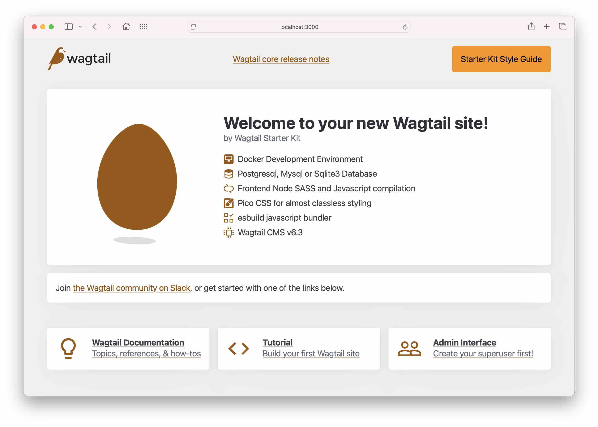

# Wagtail Starter Kit (base)

This is a starter kit for a Wagtail project. It includes a Docker setup for local development, a basic project structure, and some useful tools and libraries.

## Features

- Docker Development Environment
- Postgresql, Mysql or Sqlite3 Database
- Frontend Node SASS and Javascript compilation
- Pico CSS for almost classless styling
- esbuild javascript bundler
- Wagtail CMS v6.3



## Requirements

Required:

- [Python >= 3.10](https://www.python.org/downloads/)
- [Docker](https://www.docker.com/)
- [Docker Compose](https://docs.docker.com/compose/)
- [Node.js](https://nodejs.org/en/) (for frontend build tools)

Optional:
- [Git](https://git-scm.com/) (optional, for version control)
- [Make](https://www.gnu.org/software/make/) (optional, for running commands)
- [NVM](https://github.com/nvm-sh/nvm) (optional, for managing Node versions)
- [pre-commit](https://pre-commit.com/) (optional, for running code checks)
- [UV](https://github.com/astral-sh/uv) (optional, for managing Python dependencies)

## Getting started

1. Clone this repository [https://github.com/wagtail-examples/wagtail-starter-kit.git](https://github.com/wagtail-examples/wagtail-starter-kit.git) to a location on your computer
2. Change into the project directory
3. Run `make build` to build the Docker containers
4. Run `make up` to start the Docker containers
5. Run `make migrate` to apply database migrations
6. Run `make createsuperuser` to create a superuser
7. Run `make run` to start the Django development server

### Quick start

There is a make command to run most of the steps above in one go:

```bash
make quickstart
```

You'll need to run `make superuser` separately.

## View the site

The site will be available at [http://localhost:8000](http://localhost:8000).

The Wagtail admin interface will be available at [http://localhost:8000/admin](http://localhost:8000/admin).

## Choose a databse (optional)

By default, the project uses PostgreSQL. If you'd like to use MySQL or Sqlite3 instead uncomment the required `DC` variable in the Makefile and comment out the others.

## Frontend

### CSS Styling

The project uses [Pico CSS](https://picocss.com/) for styling. It's a minmal setup that you can build on.

When you first run the project you will probably notice that no styling is applied. This is because the first time you run the project with `make up` the compiled frontend files won't be available. Just run the frontend build scripts below and refresh the page.

### JavaScript

The project make no assumption about JavaScript libraries. You can add your own as needed.

### Build tools

The project uses [SASS](https://sass-lang.com/) for CSS compilation and [esbuild](https://esbuild.github.io/) for JavaScript bundling. You can run the build tools with the following commands:

```bash
nvm use
npm install
npm start
```

`npm start` will also run BrowserSync to reload the browser when changes are made, it makes your site available at [http://localhost:3000](http://localhost:3000)

You will need to make sure the Django server is running at the same time.

### Styleguide module

The project includes a styleguide page at [http://localhost:8000/styleguide/](http://localhost:8000/styleguide/) which demonstrates the Pico CSS classless styling and includes some common HTML elements.

The styleguide is available only in debug mode. If required you can remove the style guide from the project by removing the `styleguide` app from the `INSTALLED_APPS` in `base.py`.


## Deployment

Currenyly there is no deployment setup included in this project. You could try this [Wagtail deployment guide](https://docs.wagtail.io/en/stable/deploying/index.html) for some ideas.

There's also a tutorial here on how to deploy a Wagtail site to [PythonAnywhere](https://www.nickmoreton.co.uk/articles/deploy-wagtail-cms-to-pythonanywhere/)

## Contributing

If you have any suggestions or improvements, please open an issue or a pull request.

## License

This project is licensed under the MIT License - see the [LICENSE](LICENSE) file for details.

## Development suggestions

Sepecific suggestions for development are Comming soon... but for the moment I'd suggest you take a look at the [Wagtail documentation](https://docs.wagtail.io/en/stable/)
